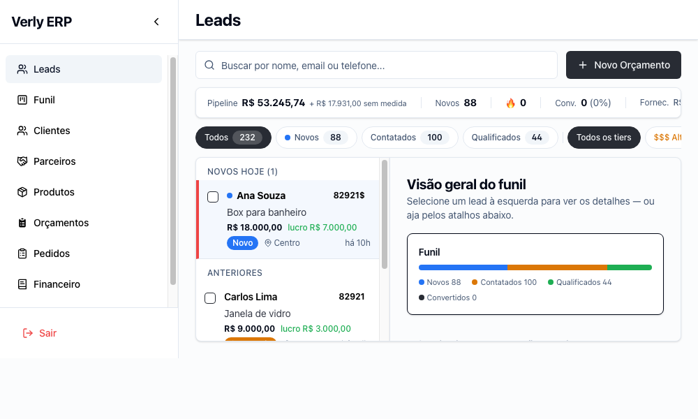
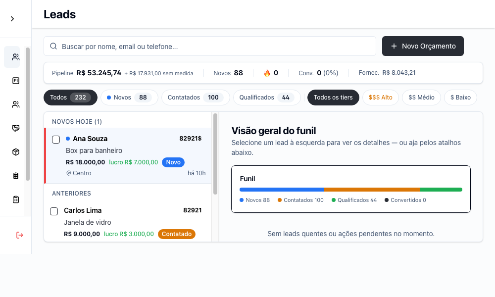
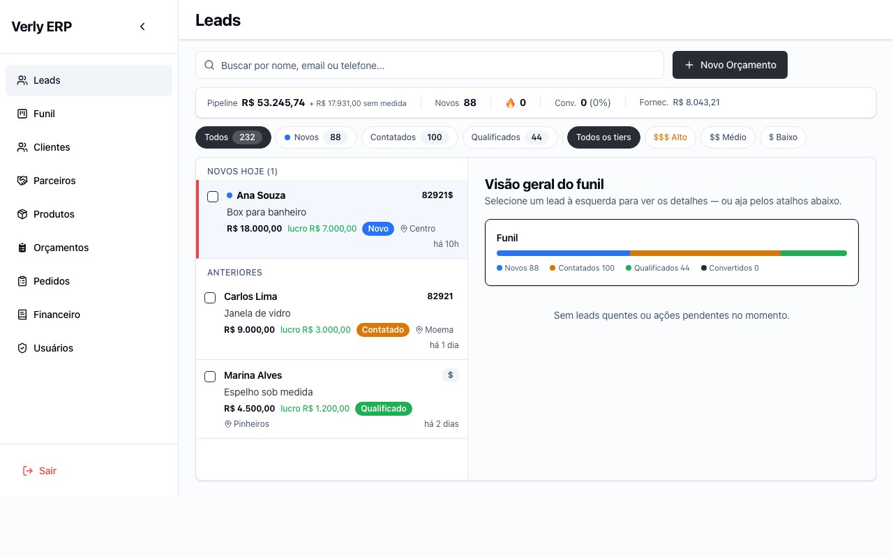
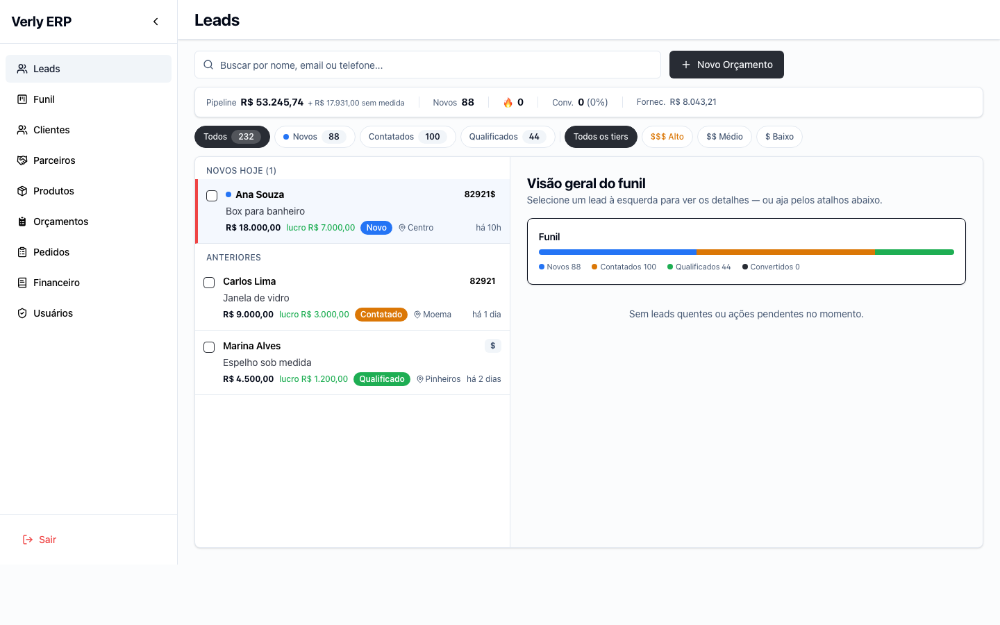

# Provas — rail da sidebar abaixo de `xl`

As capturas usam o mesmo backend mockado nas duas versões, com os totais do parecer:
232 leads, pipeline medido de R$ 53.245,74, R$ 17.931,00 sem medida, 88 novos e
R$ 8.043,21 de fornecedores. A preferência inicial da sidebar era expandida.

## Capturas

Comando executado para cada arquivo (mudando apenas nome e dimensões):

```sh
"/Applications/Google Chrome.app/Contents/MacOS/Google Chrome" \
  --headless --disable-gpu \
  --user-data-dir=/tmp/nav-c-evidence-profile \
  --virtual-time-budget=3000 \
  --screenshot="$PWD/evidencias/antes-1000x600.png" \
  --window-size=1000,600 \
  http://127.0.0.1:5173/leads
```

```sh
"/Applications/Google Chrome.app/Contents/MacOS/Google Chrome" --headless --disable-gpu --user-data-dir=/tmp/nav-c-evidence-profile --virtual-time-budget=3000 --screenshot="$PWD/evidencias/antes-1280x800.png" --window-size=1280,800 http://127.0.0.1:5173/leads
"/Applications/Google Chrome.app/Contents/MacOS/Google Chrome" --headless --disable-gpu --user-data-dir=/tmp/nav-c-evidence-profile --virtual-time-budget=3000 --screenshot="$PWD/evidencias/antes-1440x900.png" --window-size=1440,900 http://127.0.0.1:5173/leads
"/Applications/Google Chrome.app/Contents/MacOS/Google Chrome" --headless --disable-gpu --user-data-dir=/tmp/nav-c-evidence-profile --virtual-time-budget=3000 --screenshot="$PWD/evidencias/depois-1000x600.png" --window-size=1000,600 http://127.0.0.1:5173/leads
"/Applications/Google Chrome.app/Contents/MacOS/Google Chrome" --headless --disable-gpu --user-data-dir=/tmp/nav-c-evidence-profile --virtual-time-budget=3000 --screenshot="$PWD/evidencias/depois-1280x800.png" --window-size=1280,800 http://127.0.0.1:5173/leads
"/Applications/Google Chrome.app/Contents/MacOS/Google Chrome" --headless --disable-gpu --user-data-dir=/tmp/nav-c-evidence-profile --virtual-time-budget=3000 --screenshot="$PWD/evidencias/depois-1440x900.png" --window-size=1440,900 http://127.0.0.1:5173/leads
```

| Janela | Antes | Depois |
|---|---|---|
| 1000×600 |  |  |
| 1280×800 |  |  |
| 1440×900 |  |  |

Em 1000×600, o depois mostra por inteiro `Fornec. R$ 8.043,21`, `$$ Médio` e
`$ Baixo`.

## Largura útil medida no DOM

A medição foi feita no Chrome renderizado, usando:

```js
const main = document.querySelector('main')
const aside = document.querySelector('aside')
const css = getComputedStyle(main)

({
  viewport: innerWidth,
  sidebarWidth: aside.getBoundingClientRect().width,
  mainWidth: main.getBoundingClientRect().width,
  paddingLeft: parseFloat(css.paddingLeft),
  paddingRight: parseFloat(css.paddingRight),
  contentWidth:
    main.clientWidth - parseFloat(css.paddingLeft) - parseFloat(css.paddingRight),
})
```

Resultados em 1000×600:

```text
antes:  viewport 1000 - sidebar 256 - padding 24 - padding 24 = 696 px
depois: viewport 1000 - sidebar  64 - padding 24 - padding 24 = 888 px
```

Também foram medidos `clientWidth` e `scrollWidth` das duas faixas horizontais
no depois:

```json
{
  "stats": { "clientWidth": 886, "scrollWidth": 886, "overflows": false },
  "filters": { "clientWidth": 888, "scrollWidth": 888, "overflows": false }
}
```

## Preferência preservada

O botão foi acionado em 1440px para recolher a sidebar; depois o viewport foi
alterado para 1000px e novamente para 1440px pelo Chrome DevTools Protocol.
Snapshots do DOM e do `localStorage`:

```json
[
  {
    "step": "expanded at xl+",
    "viewport": 1440,
    "sidebarWidth": 256,
    "mainLeft": 256,
    "storedPreference": "false"
  },
  {
    "step": "manually collapsed at xl+",
    "viewport": 1440,
    "sidebarWidth": 64,
    "mainLeft": 64,
    "storedPreference": "true"
  },
  {
    "step": "narrowed below xl",
    "viewport": 1000,
    "sidebarWidth": 64,
    "mainLeft": 64,
    "storedPreference": "true"
  },
  {
    "step": "widened back to xl+",
    "viewport": 1440,
    "sidebarWidth": 64,
    "mainLeft": 64,
    "storedPreference": "true"
  }
]
```

Assim, a regra de largura não apaga nem altera a escolha persistida. A expansão
manual abaixo de `xl` abre sobre o conteúdo, que continua com `ml-16`.
