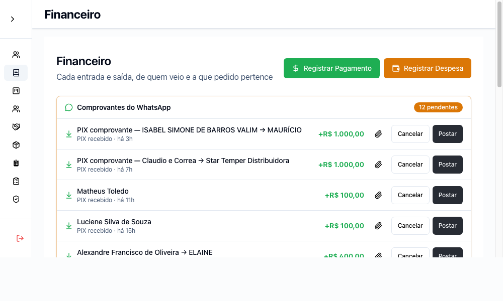
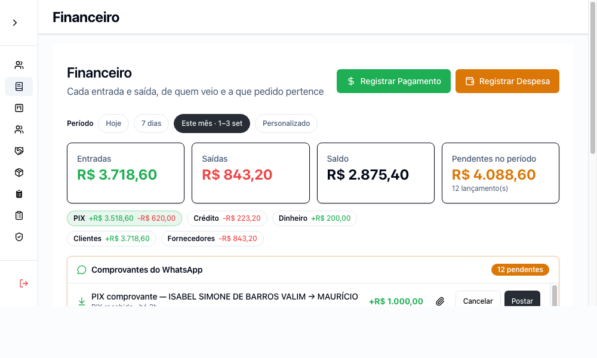
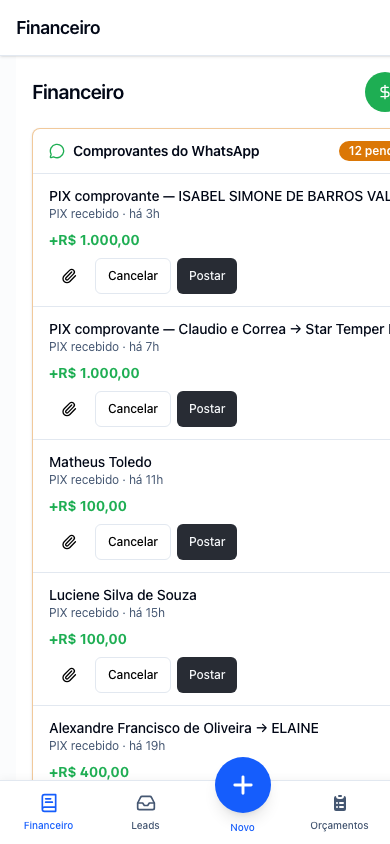
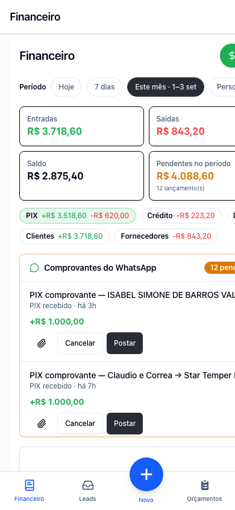

# Evidências — resumo financeiro acima da dobra

As quatro capturas usam o mesmo backend determinístico de `ledger-mock-server.mjs`,
com 12 comprovantes pendentes e totais não zerados. A fila continua sem recorte de
data; o card é identificado como `Pendentes no período` porque o endpoint de resumo
continua limitado ao intervalo selecionado.

## Preparação

```sh
PORT=18081 node evidencias/ledger-mock-server.mjs
VITE_API_URL=http://127.0.0.1:18081/verly-service npm run dev -- --host 127.0.0.1
```

`evidencias/seed.html?to=/ledger` apenas grava um JWT local de prova e abre a rota
real. Nenhum backend remoto foi consultado.

## Comandos executados

Antes, em um worktree destacado de `prod` (o Vite escolheu a porta 5176 porque as
duas anteriores já estavam ocupadas):

```sh
"/Applications/Google Chrome.app/Contents/MacOS/Google Chrome" --headless --disable-gpu --virtual-time-budget=3000 --screenshot="$PWD/evidencias/ledger-before-1000x600.png" --window-size=1000,600 "http://127.0.0.1:5176/evidencias/seed.html?to=/ledger"
"/Applications/Google Chrome.app/Contents/MacOS/Google Chrome" --headless --disable-gpu --virtual-time-budget=3000 --screenshot="$PWD/evidencias/ledger-before-390x844.png" --window-size=390,844 "http://127.0.0.1:5176/evidencias/seed.html?to=/ledger"
```

Depois, com esta alteração na porta 5180:

```sh
"/Applications/Google Chrome.app/Contents/MacOS/Google Chrome" --headless --disable-gpu --virtual-time-budget=3000 --screenshot="$PWD/evidencias/ledger-after-1000x600.png" --window-size=1000,600 "http://127.0.0.1:5180/evidencias/seed.html?to=/ledger"
"/Applications/Google Chrome.app/Contents/MacOS/Google Chrome" --headless --disable-gpu --virtual-time-budget=3000 --screenshot="$PWD/evidencias/ledger-after-390x844.png" --window-size=390,844 "http://127.0.0.1:5180/evidencias/seed.html?to=/ledger"
```

## Comparação

| Janela | Antes (`prod`) | Depois |
|---|---|---|
| 1000×600 |  |  |
| 390×844 |  |  |

Em 1000×600 e `scrollY=0`, o depois mostra por inteiro:

- `Período` e `Este mês · 1–3 set`;
- Entradas de R$ 3.718,60;
- Saídas de R$ 843,20;
- Saldo de R$ 2.875,40;
- Pendentes no período de R$ 4.088,60 e 12 lançamentos;
- o início da fila com as 12 pendências presentes.

A fila tem altura máxima de 256 px e rolagem própria, equivalente a cerca de quatro
linhas no desktop. Em 390×844, os quatro cards 2×2 também ficam inteiros acima da
fila, que preserva os botões Ver comprovante, Cancelar e Postar.

## Gate local

```text
npm ci && npm run build
✓ 1954 modules transformed
✓ built in 4.36s

npm run test:run
Test Files  23 passed (23)
Tests       157 passed (157)
```
